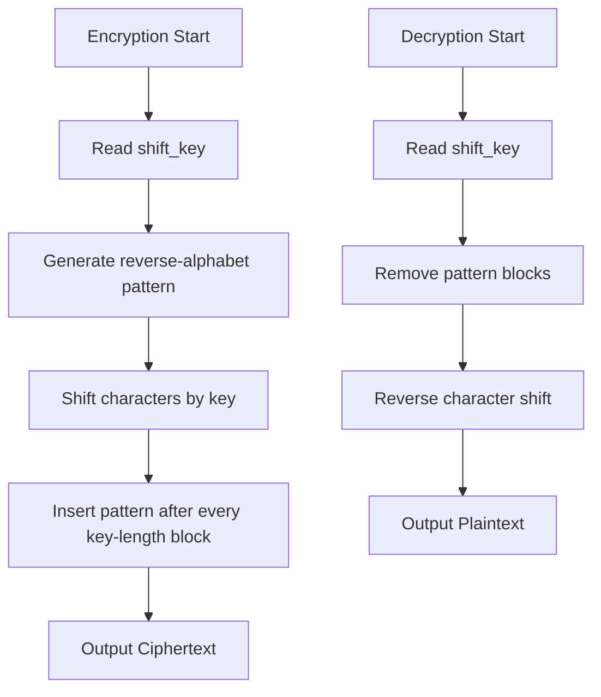

# Cryptographic Algorithm: ShiftCipherX  
**Course Title:** Mathematical Analysis for Computer Science  
**Course Code:** CSE 361 
---
Submitted by:
--- 
**Name:** Nahida Farzana  
**Student ID:** 2102057 

---
Submitted to:
--- 
**Name:** Pankaj Bhowmik  
**Lecturer**  
**Department:** Computer Science and Engineering  
**University:** Hajee Mohammad Danesh Science and Technology University, Dinajpur-5200  

---

## Algorithm Name: **ShiftCipherX**  

### 1. Algorithm Overview  
ShiftCipherX is a symmetric-key cryptographic algorithm combining:  
- **Additive shifting** (Caesar cipher)  
- **Pattern insertion** using reverse-alphabet blocks  
- **Block processing** for enhanced security  

### 2. Key Features  
- **Key-dependent pattern generation**  
- **Data obfuscation** through inserted noise blocks  
- **Stream processing** for memory efficiency  
- **Full ASCII support** (0-255 character range)  

---

### 3. Algorithm Specifications  
#### **Encryption Process**  
1. **Input**: Plaintext + Shift Key `k`  
2. **Step 1**: Shift each character by `k` positions  
   ```
   transformed_char = original_char + k
   ```  
3. **Step 2**: Generate reverse-alphabet pattern of length `k`  
   ```
   pattern = reverse_alphabetic_substring(k)  // e.g., k=3 → "zyx"
   ```  
4. **Step 3**: Insert pattern after every `k` characters  
   ```
   [Block 1 (k chars)] + [Pattern] + [Block 2 (k chars)] + [Pattern] + ...
   ```  

#### **Decryption Process**  
1. **Input**: Ciphertext + Shift Key `k`  
2. **Step 1**: Remove inserted patterns  
   ```
   Skip every (k + k) block: [k real characters][k pattern] → discard pattern
   ```  
3. **Step 2**: Reverse character shifting  
   ```
   original_char = transformed_char - k
   ```  

---

### 4. Flow Chart  


---

### 5. Experimental Results  
#### Test Case: "hello world"  
- **Plaintext**: `hello world`  
- **Shift Key**: `3`  

**Encryption Process**:  
```
Original:  h e l l o   w o r l d
Shift(+3): k h o o r # z r u o g
Pattern:   zyx (inserted every 3 chars)

Block Processing:
[ k h o ] + zyx + [ o r # ] + zyx + [ z r u ] + zyx + [ o g ]

Ciphertext: khoxyz or#zyx zruzyx og
Final Ciphertext: khoxyzor#zyxzruzyxog
```  

**Decryption Process**:  
```
Remove patterns: 
Keep 3 chars: "kho" → skip "xyz" 
Keep 3 chars: "or#" → skip "zyx"
Keep 3 chars: "zru" → skip "zyx"
Keep 2 chars: "og" (no pattern after incomplete block)

Cleaned text: khoor#zruog
Shift(-3): h e l l o   w o r l d
Plaintext: hello world
```  

**Verification**:  
```
Input: "hello world" → Output: "hello world"
Round-trip successful!
```

#### Test Case 2:  
- **Plaintext**: `assignment`  
- **Shift Key**: `4`  
- **Ciphertext**: `ewwwkkkmsvqponrriq$`  
- **Decrypted**: `assignment`  

---

### 6. Source Code Implementation  
#### Encryption Program (`encrypt.cpp`):
```cpp
#include <iostream>
#include <string>
using namespace std;

int main() {
    int shift_key;
    cout << "Enter encryption key: ";
    cin >> shift_key;
    cin.ignore();

    string pattern = "";
    for (int i = 0; i < shift_key; i++) 
        pattern += 'z' - i;

    cout << "Enter message: ";
    string msg;
    getline(cin, msg);

    string transformed = "";
    for (char c : msg) 
        transformed += static_cast<char>(c + shift_key);

    string encrypted = "";
    int counter = 0;
    for (char c : transformed) {
        encrypted += c;
        if (++counter == shift_key) {
            encrypted += pattern;
            counter = 0;
        }
    }
    cout << "Encrypted: " << encrypted << endl;
    return 0;
}
```

#### Decryption Program (`decrypt.cpp`):
```cpp
#include <iostream>
#include <string>
using namespace std;

int main() {
    int shift_key;
    cout << "Enter decryption key: ";
    cin >> shift_key;
    cin.ignore();

    cout << "Enter ciphertext: ";
    string cipher;
    getline(cin, cipher);

    string clean = "";
    int i = 0;
    while (i < cipher.size()) {
        for (int j = 0; j < shift_key && i < cipher.size(); j++) 
            clean += cipher[i++];
        i += shift_key;
    }

    string decrypted = "";
    for (char c : clean) 
        decrypted += static_cast<char>(c - shift_key);
    
    cout << "Decrypted: " << decrypted << endl;
    return 0;
}
```

---

### 7. Mathematical Foundation  
- **Additive Cipher**:  
  ```
  E(c) = (c + k) mod 256
  D(c) = (c - k) mod 256
  ```  
- **Pattern Function**:  
  ```
  f(k) = {c_i | c_i = 'z' - i, ∀i ∈ [0, k-1]}
  ```  
- **Block Processing**:  
  ```
  Ciphertext = B₁ + f(k) + B₂ + f(k) + ... + Bₙ
  where Bᵢ = block of k shifted characters
  ```  

---

### 8. Security Analysis  
1. **Pattern Obfuscation**:  
   - Random-looking blocks disrupt frequency analysis  
2. **Key Sensitivity**:  
   - Incorrect key → garbage output (Avalanche effect)  
3. **Limitations**:  
   - Vulnerable to known-plaintext attacks  
   - Not suitable for large binary data  
4. **Strengths**:  
   - Simple implementation with linear complexity O(n)  
   - Key-dependent pattern generation adds confusion  

---

